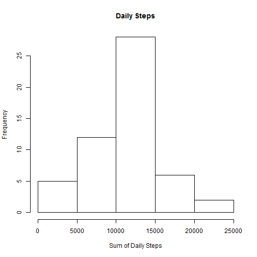
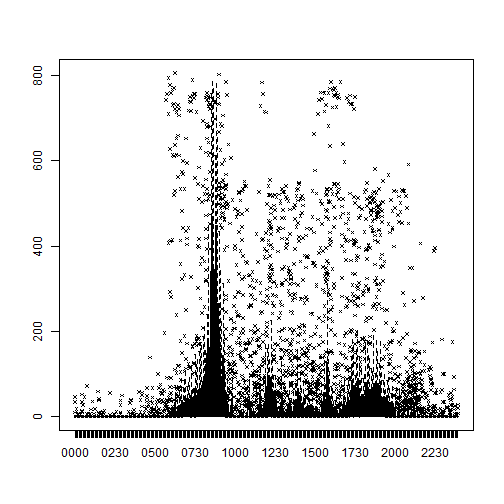
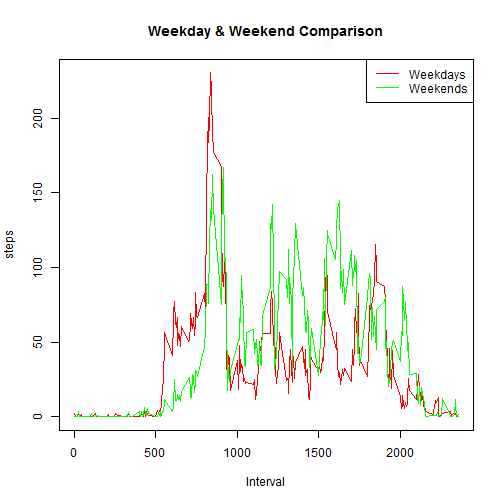

## Loading and processing the data
The following code was used to read the data out of the .zip file:

```r
activity = read.csv(unz("activity.zip", "activity.csv"), colClasses = c(NA, "Date", "character"),na.strings = "NA")
```

The interval can be transformed to time format using the following code:

```r
extractTime = function(interval){
  paste(paste(rep(0, 4-nchar(interval)),collapse = ""),interval, sep = "")
}
activity$timestring = sapply(activity$interval, extractTime)
activity$datetime = strptime(paste(activity$date, activity$timestring), format = "%Y-%m-%d %H%M")
head(activity)
```

```
##   steps       date interval timestring            datetime
## 1    NA 2012-10-01        0       0000 2012-10-01 00:00:00
## 2    NA 2012-10-01        5       0005 2012-10-01 00:05:00
## 3    NA 2012-10-01       10       0010 2012-10-01 00:10:00
## 4    NA 2012-10-01       15       0015 2012-10-01 00:15:00
## 5    NA 2012-10-01       20       0020 2012-10-01 00:20:00
## 6    NA 2012-10-01       25       0025 2012-10-01 00:25:00
```
The data now seem ready and need no further processing.

## What is mean total number of steps taken per day?
a histogram of the total number of steps taken each day:

```r
hist(tapply(activity$steps, activity$date, sum), main = "Daily Steps", xlab = "Sum of Daily Steps")
```

 

The mean and median total number of steps taken per day 

```r
mean(tapply(activity$steps, activity$date, sum), na.rm = T)
```

```
## [1] 10766.19
```

```r
median(tapply(activity$steps, activity$date, sum), na.rm = T)
```

```
## [1] 10765
```

## What is the average daily activity pattern?

```r
plot(as.factor(activity$timestring), activity$steps, outcex = 0.5, outpch = 4)
```

 

It appears that there is a major peak around 8:50 and also some smaller peaks at 12:00, 14:00, 15:30, 17:30 and 18:30 

## Imputing missing values
One reasonable imputation is imputing the missing values with the average step count of the corresponding interval:

```r
avg.step = tapply(activity$steps, activity$interval, mean, na.rm = T)
NA.index = is.na(activity$steps)
activity$steps[NA.index] = round(avg.step[activity$interval[NA.index]])
```


## Are there differences in activity patterns between weekdays and weekends?
The following code adds a factor varible to label the days in a week so we can separate weekdays and weekends:

```r
activity$day = weekdays(activity$date)
avg.step.weekday = with(activity[!activity$day %in% c("Saturday", "Sunday"),],tapply(steps, interval, mean))
avg.step.weekday=avg.step.weekday[order(as.numeric(names(avg.step.weekday)))]
avg.step.weekend = with(activity[activity$day %in% c("Saturday", "Sunday"),],tapply(steps, interval, mean))
avg.step.weekend=avg.step.weekend[order(as.numeric(names(avg.step.weekend)))]
```


Plot the difference

```r
plot(names(avg.step.weekday), avg.step.weekday,type = "l", col = "red", main = "Weekday & Weekend Comparison", ylab = "steps", xlab = "Interval")
points(names(avg.step.weekend), avg.step.weekend,type = "l", col ="green")
legend("topright", c("Weekdays","Weekends"), col = c("red", "green"), lty = 1)
```

 

